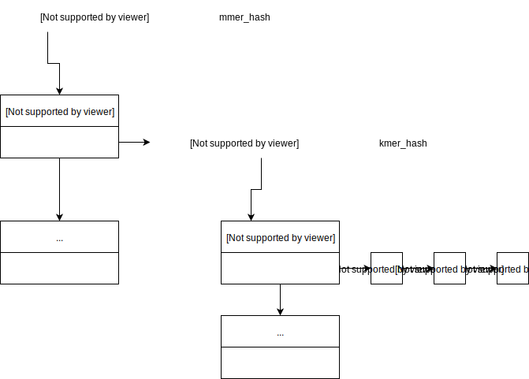
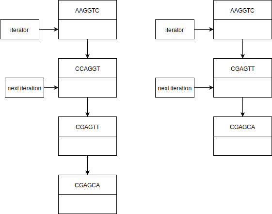
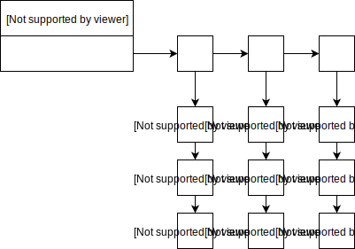
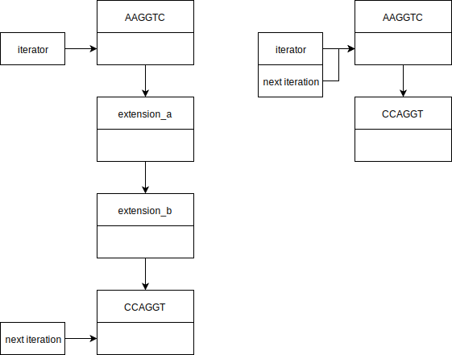

# Parallelising De Novo Genome assembler - an architecture overview

Genome assembly using Next Generation Sequencing (NGS) techniques is a developing field. Recent interest in parallelising programs to make them time and memory efficient has lead most of the development. The following text attempts to provide an architectural overview of _unitig_ extension step. This is the first part of an experiment to use _unitigs_ in a parallel computation model.

## Index
1. [Reading and Storing _kmers_](#1-reading-and-storing-kmers)  
1.1 [Converting BP to numbers](#11-converting-bp-to-numbers)  
1.2 [Efficiently extracting _kmers_ and _mmers_ from read](#12-efficiently-extracting-kmers-and-mmers-from-read)  
1.3 [Storing read id data with kmer](#13-storing-read-id-data-with-kmer)  
1.4 [Pruning low abundance _kmers_](#14-pruning-low-abundance-kmers)  
2. [Extending kmers](#2-extending-kmers)  
2.1 [Merging values of two extending _kmers_](#21-finding-extension)  
2.2 [Finding _kmer_ extensions](#22-finding-kmer-extensions)  

## 1. Reading and Storing _kmers_

The input to the program is file containing reads of DNA in each line. Each read is string of 4 possible characters {'A', 'C', 'G', 'T'} corresponding to the base pairs (BP) in DNA. **All size K sub-strings of a read are its _kmers_**. Since we cannot distinguish between two strands of the DNA we take the alphabetically smaller of the _kmer_ and its reverse complement. **Each _kmer_ has a length M signature called an _mmer_** . We take the alphabetically smallest sub-string of length M to be the _mmer_.

**Example read and deriving _kmers_ of length 6 from it, where the bold characters represent _mmers_ of length 3**

| A | A | G | T | C | C | A | T | .. |
|--|--|--|--|--|--|--|--|--|
| **A** | **A** | **G** | T | C | C  | | | |
| | **A** | **G** | **T** | C | C  | A | | |
| | | G | T | C | **C**  | **A** | **T** | |

The read information is stored in a two level hash structure. We shall refer to the first level as `mmer_hash` and the second level as `kmer_hash`. Each `mmer_hash` entry contains an _mmer_ as key and a `kmer_hash` table as value. The `kmer_hash` table contains all _kmers_ that share the same _mmer_  signature.

### 1.1 Converting BP to numbers
In various situations it is efficient and convenient to deal with BP as numbers. The programs performs the following mapping.

| A | C | G | T |
|--|--|--|--|
| 3 | 2 | 1 | 0 |

Various helper functions aid in conversion between the two forms. 
```C
   // converts numeric value of bp to its ascii value
   char getbp(int bp)
   // converts ascii character to its numeric value
   int getval(char c)
   // calculates numeric score of "string" by summing numeric scores of all characters in the string
   int getscore(char *string)
```
The scoring gives an easy method to evaluate which string is alphabetically smaller.

> score(string_a)  > score(string_b) => string_a is alphabetically
> smaller than string_b

| A | A | G | T | C | C |
|:---:|:---:|:---:|:---:|:---:|:---:|
| 1024 | 256 | 64 | 16 | 4 | 1 |
| 3*1024 | 3*256 | 1*64 | 0*16 | 2*4 | 2*1 |

The kmer gives a score of 10058.

| T | T | C | A | G | G |
|:---:|:---:|:---:|:---:|:---:|:---:|
| 1024 | 256 | 64 | 16 | 4 | 1 |
| 0*1024 | 0*256 | 2*64 | 3*16 | 1*4 | 1*1 |

The reverse complement given a score of 181. Only the kmer, since it has a higher score, will be taken as a unique representation whenever either it or its reverse complement is encountered. **The selected string is a _canonical_ representaion**.

### Efficiently extracting _kmers_ and _mmers_ from read
The `main` function takes `input_file` and passes the read from each line to `process_read` function. 

```C
/** 
* Usage:
* stores all kmers of a read
* kmers are stored in 2 level hashing
* Arguments:
* hash_table: mmer hash table
* read: read from which kmers are be parsed and stored
* read_id: for debugging purposes
*/
struct ZHashTable *process_read(struct ZHashTable *hash_table, char *read, int read_id)
```
A sliding window of length `KMER_SIZE` is passed over the read to get the `kmer`. It calculates the score of the first kmer, for rest of the kmers its subtracts to value of the leaving character and adds the value of added character.

|||||||||
|:---:|:---:|:---:|:---:|:---:|:---:|:---:|:---:|
| A | A | G | T | C | C |
| 3072 | 768 | 64 | 0 | 8 | 2 | |10058
| | A | G | T | C | C  | A | |
| | 3072 | 256 | 0 | 32 | 8 | 3 | (10058 - 3072)*4 + 3

Similarly the reverse complement is computed and the alphabetically smaller is taken. The _mmer_ computation is optimized to minimize passes.

||||||||||
|:---:|:---:|:---:|:---:|:---:|:---:|:---:|:---:|:---|
|v|v|||||||
| G | **A** | **A** | **C** | **A** | G |  | | when the kmer pointer is behind mmer pointer, only compare mmer created by newly added character
||vv|||||||
| | **A** | **A** | **C** | **A** | G  | A | | score(AACA) > score(CAGA)
|||v||v||||
| | | A | C | **A** | **C**  | **A** | **A** |when the kmer pointer crosses the mmer pointer, compare all mmers to get the smallest one

Taking _canonical mmers_ halves the possible mmer values. Only the top row can be present as keys in `mmer_hash`.

|AAAA|AAAG|..|CTTG|CTTT|
|:---:|:---:|:---:|:---:|:---:|
|TTTT|TTTC|..|GAAC|GAAA|

The computed _mmer_ and _kmer_ are then stored in the two level hash structure. 

### 1.3 Storing read id data with kmer
Each _kmer_ stores the read ids from which it has been derived. A linked list of read ids in the descending order is stored as the value `kmer_hash` entry where key is the _kmer_ string. Each read is numbered in by a counter. If a _kmer_ has occured before the new read id is added to the beginning of linked list.



### 1.4 Pruning low abundance _kmers_
Due to errors in experiment BP can be misread. _Kmers_ derived from reads containing erroneous BP have low abundance in the dataset. The following algorithm is used to prune the data.

> 1. iterate `mmer_hash`entries
> 2. iterate `kmer_hash`entries in current `mmer_hash_entry`
> 3. `count` number of nodes in read id list in current `kmer_hash_entry`
> 4. if `count` is less than `ABUNDANCE_CUTOFF` mark for deletion
> 5. when iteration is over if current `kmer_hash_entry` is empty delete it

Efficient deletion safe iteration is performed by using a double indirection method.
```C
/**
 * Usage:
 * 1. Iteration: returns entries in hash_table one by one and NULL when no other entries left
 * hash_table: pass the same pointer while iterating it
 * indirection: false returns a pointer to the entry, true returns a pointer to the pointer of the entry
 * indirection is useful when modifying entries
 * remove_current: don't care
 * if deletion was called previously current entry is removed and next entry is returned
 * 2. Deletion: marks current entry for removal which is removed when next iteration in called
 * hash_table: pass NULL
 * indirection: don't care
 * remove_current: true
 * Note: be careful with deletion when performing nested iteration on the same hash_table
*/
void *iterate_level_one_hash(struct ZHashTable *hash_table, bool indirection, bool remove_current)
```
 The program maintains `traversal` a pointer to a pointer to a `struct ZHashEntry` that is stored in the passed hash_table.
 * On each iteration call the current entry is returned and `traversal` is moved ahead, entry by entry chain by chain. 
 * On deletion is called, the current entry is marked. On the next iteration call the current entry is freed, however `traversal` is not modified. Instead the pointer it points to contains the location of the next entry after current.

The diagram below shows deletion and iteration for one chain in the `hash_table`. When deletion is 



Because the program uses two levels of hashing and the iterator uses static variables to maintain state of currently iterating `hash_table`, two identical iterators (except their name) have been implemented to allow nested iteration.

After pruning the data, the read id list is duplicated for each BP in the _kmer_ which produces a linked list of linked lists.



## 2. Extending kmers
_Kmers_ can be extended in left (backward) and right (forward) direction. **An extension is possible if a _kmer_ overlaps with only one other _kmer_ at `K-1` BP in a given direction**. A _kmer_ can be extended multiple times, it size changing each time as it grows. The purpose of this procedure is to efficiently extend all possible kmers that do not conflict or branch. This will reduce work being done in the branch resolution step.

### 2.1  Merging values of two extending _kmers_
When two _kmers_ are found for extension, there strings and read id lists are merged. The example demonstrates the results of a merging.

||||||||
|:---:|:---:|:---:|:---:|:---:|:---:|:---:|
| **A** | **A** | **G** | **T** | **C** | **C**  | |
| 7 | 7 | 7 | 7 | 7 | 7  | |
| 3 | 3 | 3 | 3 | 3 | 3  | |
| | **A** | **G** | **T** | **C** | **C**  | **A** |
||11|11|11|11|11|11|
||7|7|7|7|7|7|
|-|-|-|-|-|-|-|
| **A** | **A** | **G** | **T** | **C** | **C**  | **A** |
| 7 | 11 | 11 | 11 | 11 | 11 | 11 |
| 3 | 7 | 7 | 7 | 7 | 7  |7|
|   | 3 | 3 | 3 | 3 | 3  | |

Linked lists of read ids for the overlapping entries merges them in sorted order removing any  duplicate occurences. A new string is allocated for creating the merged _kmer_ string.
```C
// return new list of read id lists where continuous range of KMER_SIZE - 1 nodes of a_node and b_node are merged
// forward direction merges right end of a_node with left end of b_node
// backward direction merges right end of b_node with left end of a_node
ll_node *merge_lists(int a_len, int b_len, ll_node *a_node, ll_node *b_node, bool forward)

// returns merged key of a_key and b_key which overlap at continuous KMER_SIZE - 1 base pairs
// forward direction merges right end of a_key with left end of b_key
// backward direction merges right end of b_key with left end of a_key
char *merge_keys(int a_len, int b_len, char *a_key, char *b_key, bool forward)

// extends to kmer entries pointed to by given hash entries in given direction
// returns node containing pointer to merged kmer and read id list
// Note: does not free given a and b hash table entries
more_kmer_extension_node extend_kmers(struct ZHashEntry *a, struct ZHashEntry *b, bool forward)

// takes partially extended kmer and extends with kmer in hash entry b
// returns node containing pointer to merged kmer and read id list
// Note: manages de-allocation of memory for previous key
more_kmer_extension_node further_extend_kmers(more_kmer_extension_node a, struct ZHashEntry *b, bool forward)
```

The result of the extension is called a _unitig_. Before being stored back in the hash structure. It is checked for further extensions with other _kmers_ or _unitigs_ present in the hash structure. When no further extension is possible the _unitig_ is stored back in the hash structure.

There is a **fundamental difference between the first extension and further extensions**. The first extension involves two hash entries which are then deleted and the _unitig_ information exists in an intermediate `struct more_kmer_extension_node`. Further extension occur with the intermediate structure and a hash entry which is deleted after extension.

### 2.2 Finding _kmer_ extensions
The algorithm for finding extensions exploits the total ordering of _mmers_. A _kmer_ can only be extended with _kmers_ having _mmer_ having score less than equal its own in either direction. Trivially a _kmer_ corresponding to "CCCT" cannot be extended.

> 1. iterate over _mmers_ in order of increasing score
> 2. iterate over all _kmer_ entries in `hash_table` corresponding to current _mmer_
> 3. check _mmers_ created by single BP extension of _kmer_ in current _kmer_ entry (there are only 4 possible extensions)
> 4. if an extended _kmer_ yields a extension _mmer_ with score less than equal to current _mmer_, iterate over all entries of extension _mmer_
> 5. for each _kmer_ entry in extension _mmer_ table check for `K-1` BP overlap
> 6. if only one _kmer_ satisfies condition for current _kmer_ entry, then it is a valid extension

The example shows extension _mmers_, in the forward direction.

|||||||||
|:---:|:---:|:---:|:---:|:---:|:---:|:---:|:---:|
| **C** | **C** | **G** | **C** | A | A |
||||**C**| **A** | **A** | **A**
||||**C**| **A** | **A** | **C**
||||**C**| **A** | **A** | **G**
||||**C**| **A** | **A** | **T**

**Deleting entries selected for extension is tricky**. Simultaneous nested iteration and deletion can cause memory corruption when both entries are adjacent and in the same `hash_table`. The iterator cannot handle complex multiple deletions. As shown below each case is to be individually handled in find extension function to prevent missing entries or memory corruption. 




## Future steps
1. Parallelize _unitig_ creation
2. Implement branch creation for _unitigs_, branch resolution will  yield _contigs_  
3. Perform data analytics to determine percentage of _unitigs_ affected by extension
4. Algorithm for variable length unitig extension

<!--stackedit_data:
eyJoaXN0b3J5IjpbMTQxMTcwMzExNCw5MjUxNTAyOTYsMTc1Mz
I0MDc5NCwtNzE0NzA5NDg2XX0=
-->