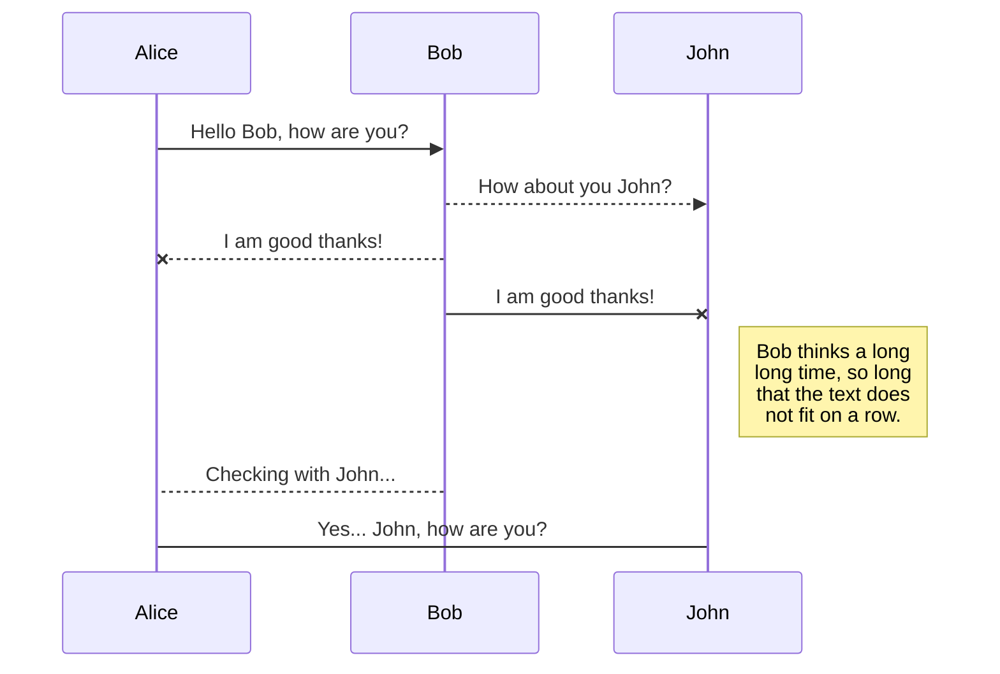
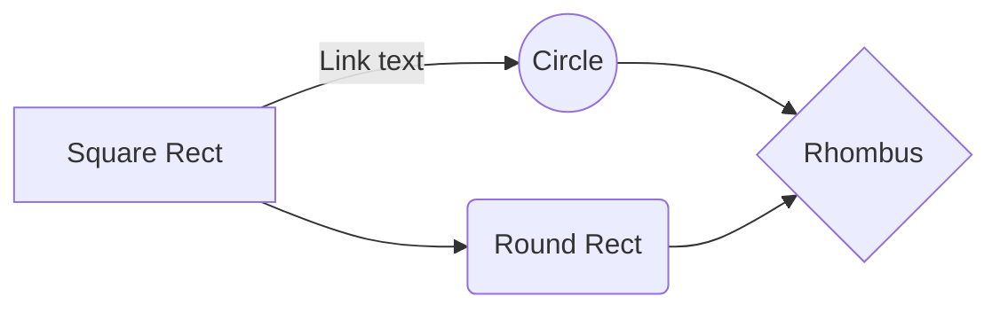

# Parallelising De Novo Genome assembler - an architecture overview

Genome assembly using Next Generation Sequencing (NGS) techniques is a developing field. Recent interest in parallelising programs to make them time and memory efficient has lead most of the development. The following text attempts to provide an architectural overview of _unitig_ extension step. This is the first part of an experiment to use _unitigs_ in a parallel computation model.

##  1. Reading and Storing _kmers_

The input to the program is file containing reads of DNA in each line. Each read is string of 4 possible characters {'A', 'C', 'G', 'T'} corresponding to the base pairs in DNA. All size K sub-strings of a read are its _kmers_. Since we cannot distinguish between two strands of the DNA we take the alphabetically smaller of the _kmer_ and its reverse complement. Each _kmer_ has a length M signature called an _mmer_ . We take the alphabetically smallest sub-string of length M to be the _mmer_.

**Example read and deriving kmers of length 6 from it, where the bold characters represent mmers of length 3**

| A | A | G | T | C | C | A | T | ..  | 
|--|--|--|--|--|--|--|--|--|--|
| **A** | **A** | **G** | T | C | C  | | |
| | **A** | **G** | **T** | C | C  | A | |
| | | G | T | C | **C**  | **A** | **T** |

The read information is stored in a two level hash structure. We shall refer to the first level as `mmer_hash` and the second level as `kmer_hash`. Each `mmer_hash` entry contains an _mmer_ as key and a `kmer_hash` table as value. The `kmer_hash` table contains all _kmers_ that share the same _mmer_  signature.

### 1.1 Converting base pairs to numbers
In various situations it is efficient and convenient to deal with base pairs as numbers. The programs performs the following mapping.
| A | C | G | T |
|--|--|--|--|
| 3 | 2 | 1 | 0 |
Various helper functions aid in conversion between the two forms. 
```C
   // converts numeric value of bp to its ascii value
   char getbp(int bp)
   // converts ascii character to its numeric value
   int getval(char c)
   // calculates numeric score of "string" by summing numeric scores of all characters in the string
   int getscore(char *string)
```
The scoring gives an easy method to evaluate which string is alphabetically smaller. 			       

> score(string_a)  > score(string_b) => string_a is alphabetically
> smaller than string_b

| A | A | G | T | C | C |
|:---:|:---:|:---:|:---:|:---:|:---:|:---:|:---:|
| 1024 | 256 | 64 | 16 | 4 | 1 |
| 3*1024 | 3*256 | 1*64 | 0*16 | 2*4 | 2*1 |
The kmer gives a score of 10058.
| T | T | C | A | G | G |
|:---:|:---:|:---:|:---:|:---:|:---:|:---:|:---:|
| 1024 | 256 | 64 | 16 | 4 | 1 |
| 0*1024 | 0*256 | 2*64 | 3*16 | 1*4 | 1*1 |
The reverse complement given a score of 181 and hence only the kmer will be taken as a unique representation whenever either it or its reverse complement is encountered.
### 1.2 Efficiently extracting _kmers_ and _mmers_ from read
The `main` function takes `input_file` and passes the read from each line to `process_read` function. 

```C
/** 
* Usage:
* stores all kmers of a read
* kmers are stored in 2 level hashing
* Arguments:
* hash_table: mmer hash table
* read: read from which kmers are be parsed and stored
* read_id: for debugging purposes
*/
struct ZHashTable *process_read(struct ZHashTable *hash_table, char *read, int read_id)
```
A sliding window of length `KMER_SIZE` is passed over the read to get the `kmer`. It calculates the score of the first kmer, for rest of the kmers its subtracts to value of the leaving character and adds the value of added character.
|||||||||
|:---:|:---:|:---:|:---:|:---:|:---:|:---:|:---:|
| A | A | G | T | C | C |
| 3072 | 768 | 64 | 0 | 8 | 2 | |10058
| | A | G | T | C | C  | A | |
| | 3072 | 256 | 0 | 32 | 8 | 3 | (10058 - 3072)*4 + 3
Similarly the reverse complement is computed and the alphabetically smaller is computed. The _mmer_ computation is optimized to minimize passes.
||||||||||
|:---:|:---:|:---:|:---:|:---:|:---:|:---:|:---:|:---|
|v|v|||||||when the kmer pointer is behind, only compare mmer created by newly added character
| G | **A** | **A** | **C** | **A** | G |  | | ||
||vv|||||||score(AACA) > score(CAGA)
| | **A** | **A** | **C** | **A** | G  | A | || 
|||v||v|||| when the kmer pointer crosses the mmer pointer, compare all mmers to get the smallest one
| | | A | C | **A** | **C**  | **A** | **A** |
The computer _mmer_ and _kmer_ are then stored in the two level hash structure.

### 1.3 Pruning low abundance _kmers_

 

## Delete a file

You can delete the current file by clicking the **Remove** button in the file explorer. The file will be moved into the **Trash** folder and automatically deleted after 7 days of inactivity.

## Export a file

You can export the current file by clicking **Export to disk** in the menu. You can choose to export the file as plain Markdown, as HTML using a Handlebars template or as a PDF.


# Synchronization

Synchronization is one of the biggest features of StackEdit. It enables you to synchronize any file in your workspace with other files stored in your **Google Drive**, your **Dropbox** and your **GitHub** accounts. This allows you to keep writing on other devices, collaborate with people you share the file with, integrate easily into your workflow... The synchronization mechanism takes place every minute in the background, downloading, merging, and uploading file modifications.

There are two types of synchronization and they can complement each other:

- The workspace synchronization will sync all your files, folders and settings automatically. This will allow you to fetch your workspace on any other device.
	> To start syncing your workspace, just sign in with Google in the menu.

- The file synchronization will keep one file of the workspace synced with one or multiple files in **Google Drive**, **Dropbox** or **GitHub**.
	> Before starting to sync files, you must link an account in the **Synchronize** sub-menu.

## Open a file

You can open a file from **Google Drive**, **Dropbox** or **GitHub** by opening the **Synchronize** sub-menu and clicking **Open from**. Once opened in the workspace, any modification in the file will be automatically synced.

## Save a file

You can save any file of the workspace to **Google Drive**, **Dropbox** or **GitHub** by opening the s**Synchronization step for binning, While merging the bins, we need to know which bins will stay on which node. For that , we need to know the total no. of bins and the total no of nodes. To know the total no. of bins , we need another global communication. Is there any other way to do this?

e** sub-menu and clicking **Save on**. Even if a file in the workspace is already synced, you can save it to another location. StackEdit can sync one file with multiple locations and accounts.

## Synchronize a file

Once your file is linked to a synchronized location, StackEdit will periodically synchronize it by downloading/uploading any modification. A merge will be performed if necessary and conflicts will be resolved.

If you just have modified your file and you want to force syncing, click the **Synchronize now** button in the navigation bar.

> **Note:** The **Synchronize now** button is disabled if you have no file to synchronize.

## Manage file synchronization

Since one file can be synced with multiple locations, you can list and manage synchronized locations by clicking **File synchronization** in the **Synchronize** sub-menu. This allows you to list and remove synchronized locations that are linked to your file.


# Publication

Publishing in StackEdit makes it simple for you to publish online your files. Once you're happy with a file, you can publish it to different hosting platforms like **Blogger**, **Dropbox**, **Gist**, **GitHub**, **Google Drive**, **WordPress** and **Zendesk**. With [Handlebars templates](http://handlebarsjs.com/), you have full control over what you export.

> Before starting to publish, you must link an account in the **Publish** sub-menu.

## Publish a File

You can publish your file by opening the **Publish** sub-menu and by clicking **Publish to**. For some locations, you can choose between the following formats:

- Markdown: publish the Markdown text on a website that can interpret it (**GitHub** for instance),
- HTML: publish the file converted to HTML via a Handlebars template (on a blog for example).

## Update a publication

After publishing, StackEdit keeps your file linked to that publication which makes it easy for you to re-publish it. Once you have modified your file and you want to update your publication, click on the **Publish now** button in the navigation bar.

> **Note:** The **Publish now** button is disabled if your file has not been published yet.

## Manage file publication

Since one file can be published to multiple locations, you can list and manage publish locations by clicking **File publication** in the **Publish** sub-menu. This allows you to list and remove publication locations that are linked to your file.


# Markdown extensions

StackEdit extends the standard Markdown syntax by adding extra **Markdown extensions**, providing you with some nice features.

> **ProTip:** You can disable any **Markdown extension** in the **File properties** dialog.


## SmartyPants

SmartyPants converts ASCII punctuation characters into "smart" typographic punctuation HTML entities. For example:

|                |ASCII                          |HTML                         |
|----------------|-------------------------------|-----------------------------|
|Single backticks|`'Isn't this fun?'`            |'Isn't this fun?'            |
|Quotes          |`"Isn't this fun?"`            |"Isn't this fun?"            |
|Dashes          |`-- is en-dash, --- is em-dash`|-- is en-dash, --- is em-dash|


## KaTeX

You can render LaTeX mathematical expressions using [KaTeX](https://khan.github.io/KaTeX/):

The *Gamma function* satisfying $\Gamma(n) = (n-1)!\quad\forall n\in\mathbb N$ is via the Euler integral

$$
\Gamma(z) = \int_0^\infty t^{z-1}e^{-t}dt\,.
$$

> You can find more information about **LaTeX** Dmata sets : https://www.ebi.ac.uk/ena

 hematical expressions [here](http://meta.math.stackexchange.com/questions/5020/mathjax-basic-tutorial-and-quick-reference).


## UML diagrams

You can render UML diagrams using [Mermaid](https://mermaidjs.github.io/). For example, this will produce a sequence diagram:



And this will produce a flow chart:



<!--stackedit_data:
eyJoaXN0b3J5IjpbLTczOTQxMTgwNiwtNzE0NzA5NDg2XX0=
-->